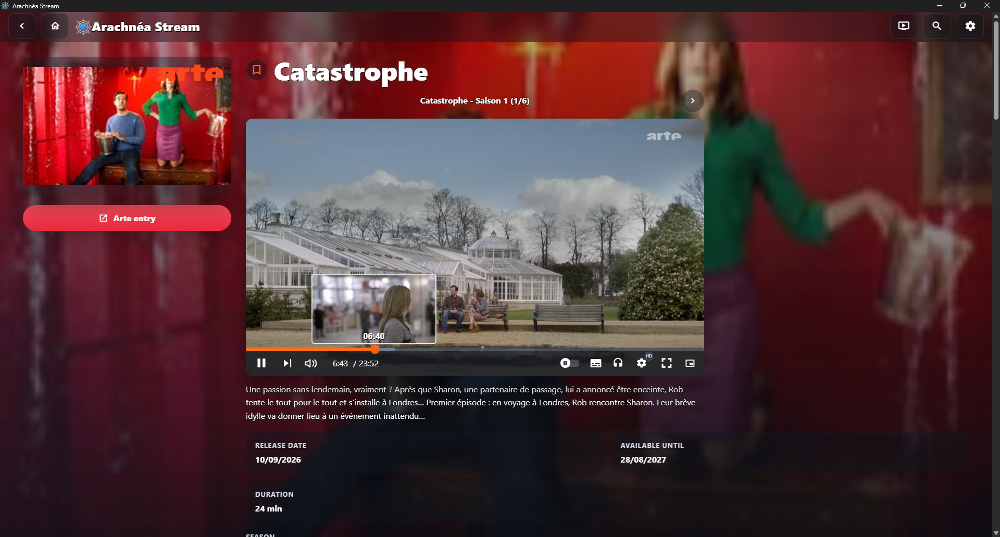
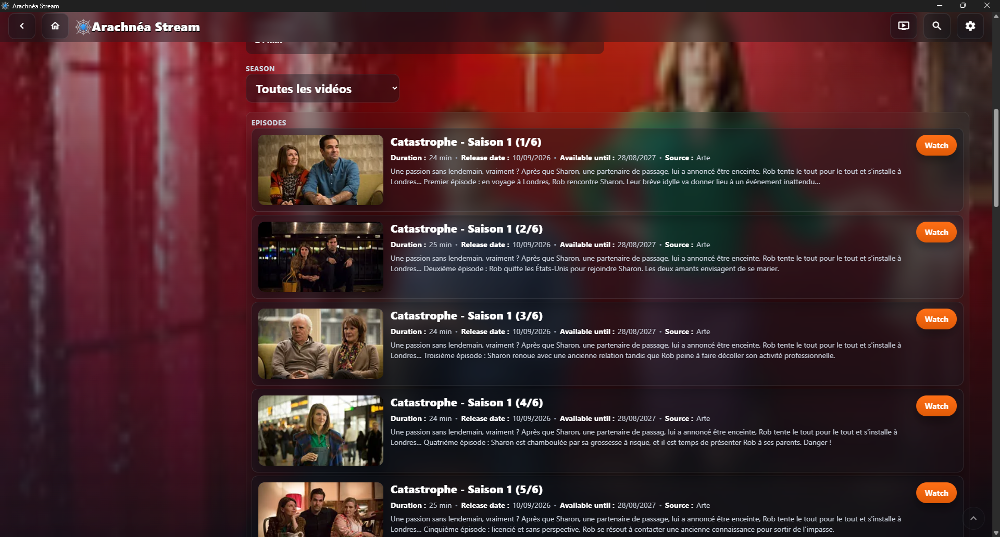
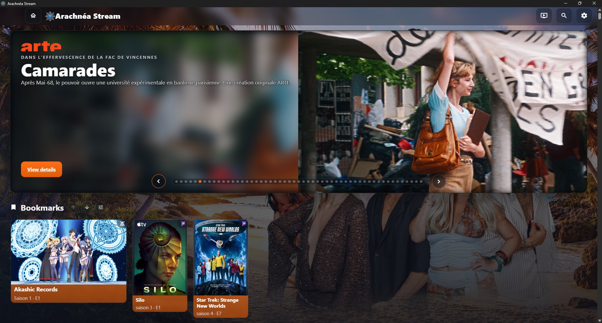
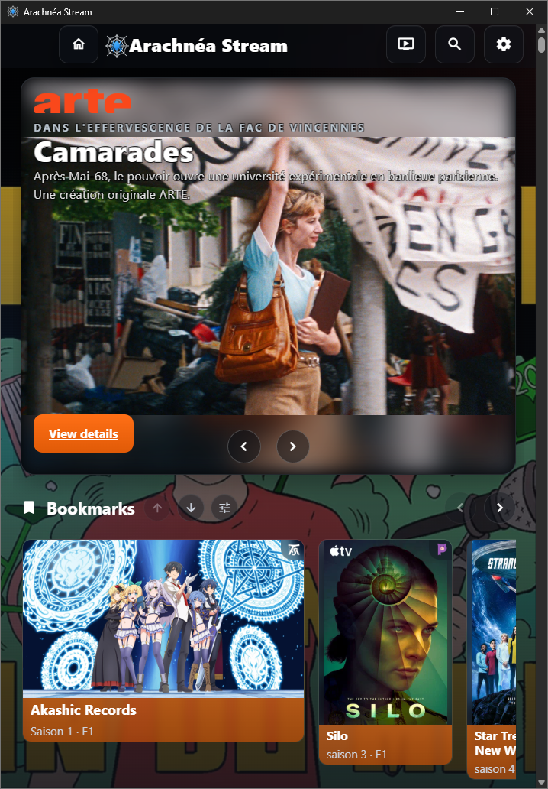
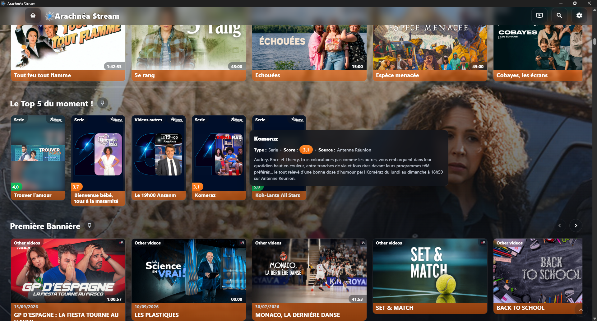
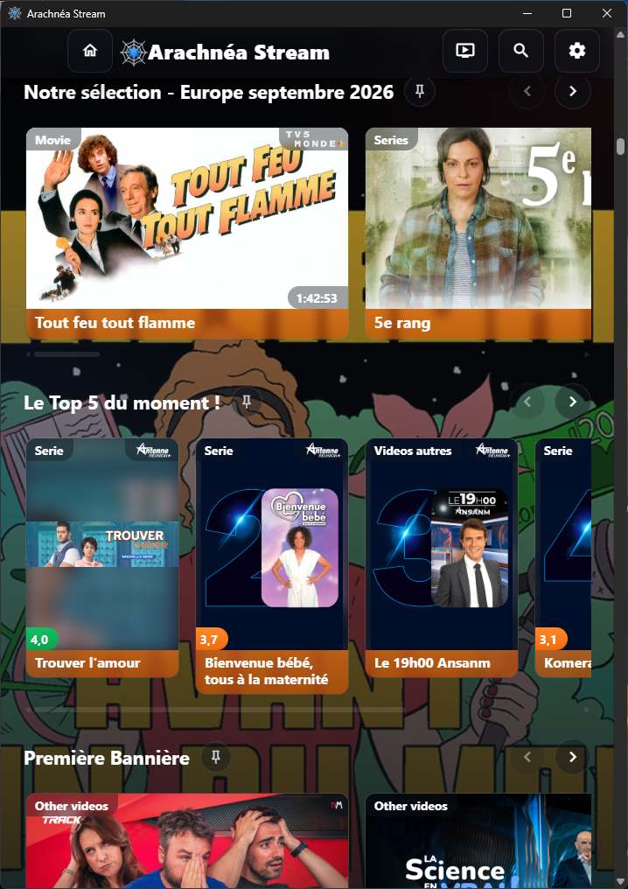
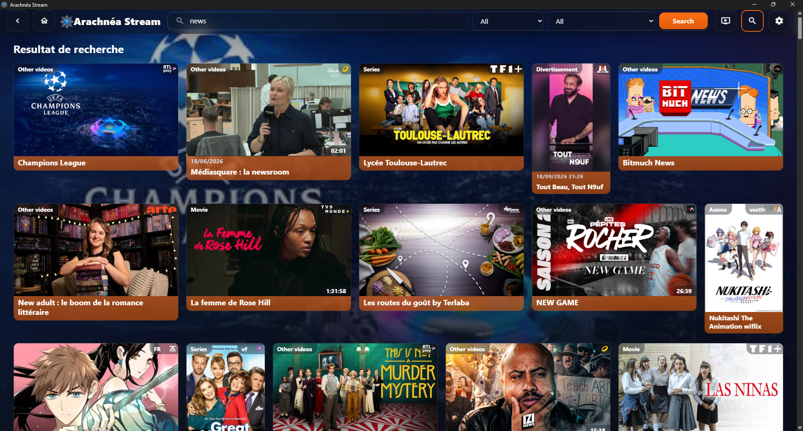

<p align="center">
  
</p>

# Arachnea Stream

**Arachnea Stream** is a streaming application that centralizes multiple
streaming services behind a single interface. Instead of juggling separate
apps and websites (legal platforms, alternative catalogs, live TV
channels...), the user finds all catalogs, searches, and video players in one
place.

The application ships in two execution modes:

- **Desktop application** (Tauri) for Windows, macOS, and Linux;
- **Server mode**: the web interface and API are reachable from a browser on
  the local network (for example `http://localhost:8080/`).

## Features

### Centralizing streaming services

- Every streaming service (TF1+, M6 Play, France TV, RTBF Auvio, Anime-Sama,
  etc.) is described by a **collection file** and exposed as a uniform source
  in the interface.
- A unified catalog aggregates entries from every enabled service: users
  browse media cards without caring about the originating platform.
- Services can be **enabled or disabled** individually from the
  administration interface, with persisted preferences.

### Extensible through YAML files

- The core of the system is a **YAML-driven scraping engine**
  (`arachnea-scrapyfy`): adding a new service means writing a YAML file that
  describes its HTTP requests and how to shape the responses (JSON or HTML),
  without touching application code.
- Each collection declares up to **10 standard queries**: service metadata,
  home page, categories and paginated sections, promotional banners, search,
  entry details, season episodes, and live channels.
- Per-source HTTP configuration handles both plain APIs (`direct`) and
  Cloudflare-protected sites (`auto`), with user-agent profiles and proxy
  support.
- Services can be hot-reloaded through the administration API, without
  restarting the application.

### Watching videos

- **Built-in video player** (Video.js) with HLS and DASH support, including
  multi-period streams.
- **Stream resolution**: player resolvers extract the actual playback URL
  from service pages, including third-party streaming hosters.
- Plays **live TV** and VOD episodes (movies, series, anime, documentaries,
  sport, kids, news...).

<p align="center">
  <a href="docs/screenshots/entry_01.png"></a>
</p>
<p align="center">
  <a href="docs/screenshots/entry_02.png"></a>
</p>

### Browsing and discovery

- **Per-service home page**: sections, categories, and highlighted banners,
  just like the original platform.
- **Categories and sections**: filtered navigation by channel or topic, with
  pagination.
- **Detailed entry pages**: synopsis, artwork (posters, banners), seasons,
  and episodes.
- **Normalized media types** (movie, series, anime, documentary, sport, kids,
  news, live, manga/webtoon) for consistent navigation across sources.

<p align="center">
  <a href="docs/screenshots/home_01.png"></a>
  <a href="docs/screenshots/home_02.png"></a>
</p>
<p align="center">
  <a href="docs/screenshots/home_03.png"></a>
  <a href="docs/screenshots/home_04.png"></a>
</p>

### Search

- **Multi-source search**: a single search bar queries every enabled service
  and aggregates the results.
- Supports the **filters** declared by each source in its YAML.
- Caching and conditional validation (ETag) keep responses fast and cheap on
  bandwidth.

<p align="center">
  <a href="docs/screenshots/search_01.png"></a>
</p>

### Administration interface

- Admin API mounted under `/api/admin/...` (web) or reachable through Tauri
  `invoke` commands (desktop).
- **Service management**: enable/disable, full catalog with localized
  descriptions and logos.
- **Credential management**: encrypted per-service credential storage (for
  platforms that require sign-in).
- **Settings**: port, root, and network mode, applied hot whenever possible.
- **Admin password** (Argon2id hashing), cookie sessions, login rate
  limiting, and CSRF protection.
- **Hot reload** of service groups with atomic runtime swap.

### Privacy and network infrastructure

- **Built-in proxy** (`arachnea-proxy`): outbound request routing,
  configurable transports (HTTP/HTTPS/SOCKS), loopback-only listener by
  default.
- **Custom DNS resolution** (`arachnea-dns`) with policies, cache, and
  upstream transports.
- **Egress country detection** (`arachnea-ip-countries`) to adapt
  geo-restricted requests.

## Screenshots

Feature screenshots are shown inline in the sections above
([Watching videos](#watching-videos),
[Browsing and discovery](#browsing-and-discovery),
[Search](#search)). Images are rendered centered at 80% width (the home
desktop/smartphone pairs share a fixed height); click any image to view it
full size. Screenshot files live in `docs/screenshots/`.

## Getting started

### Download a release

Prebuilt installers (Windows NSIS/MSI, macOS `.dmg`, Linux `.deb`/`.rpm`/
`.AppImage`, plus a portable Windows `.zip`) are produced for every release —
grab the latest one from the repository's **Releases** page.

### Run from sources

See [`docs/BUILDING.md`](docs/BUILDING.md) for full prerequisites and build
commands. The short version:

```bash
cd server
cargo run -p arachnea-stream --bin arachnea   # desktop executable / local server
```

## Legal notice

Arachnea Stream is an aggregator: it does not host any media. Content comes
from third-party sources described by YAML collections, and some sources may
be subject to the laws of your country. Use the sources available to you in
accordance with applicable legislation.

## License

Arachnea Stream is dual-licensed under the **MIT license** and the
**Apache License 2.0**, at your option — see
[`LICENSE-MIT`](LICENSE-MIT) and [`LICENSE-APACHE`](LICENSE-APACHE).
This matches the `license = "MIT OR Apache-2.0"` declaration used across the
workspace manifests.

Unless you explicitly state otherwise, any contribution submitted for
inclusion in the project is licensed, at the project's option, under both
licenses, without any additional terms or conditions.

## Skills

The following Codex skills are provided by this project.

- `#build-yaml-source` - Create or update one Arachnea scraper YAML from one or more source URLs by analyzing the target website, reusing patterns from `server/services/*.yaml`, and checking supported scraper capabilities in `server/crates/arachnea-scrapyfy/src/scrapyfy/*`.
- `#update-readme` - Maintain all Arachnea README.md files by updating Cargo commands, NPM commands, crate summaries, and the list of project-related Codex skills.

## Documentation

- [`CONTRIBUTING.md`](CONTRIBUTING.md) - how to contribute (workflow, source YAML guide, licensing of contributions).
- [`SECURITY.md`](SECURITY.md) - how to report security vulnerabilities.
- [`docs/BUILDING.md`](docs/BUILDING.md) - build prerequisites, commands, and release packaging.
- [`docs/specifications/`](docs/specifications/) - YAML scraper format specifications (English and French).
- [`CHANGELOG.md`](CHANGELOG.md) - notable changes.
