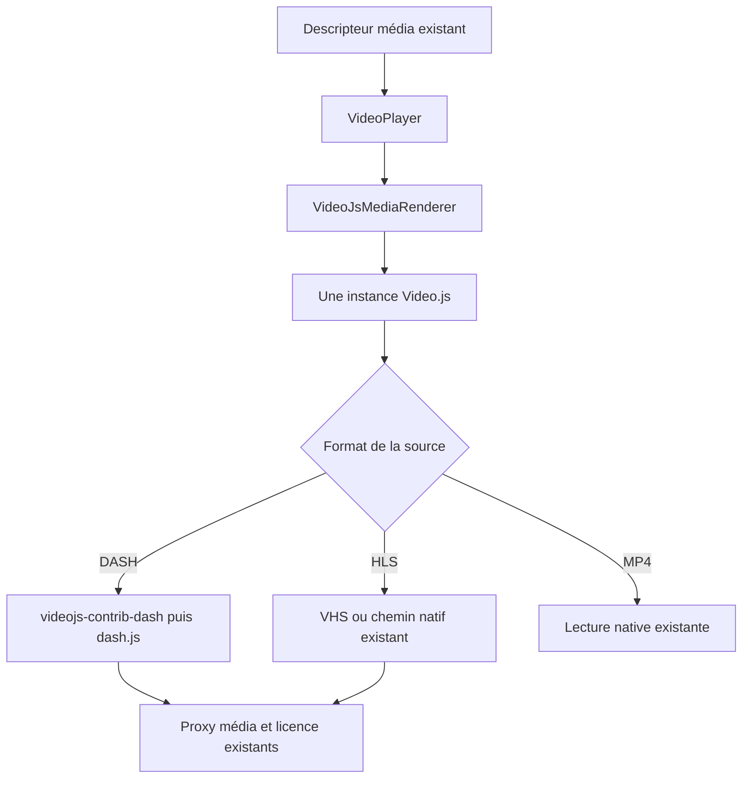

# Analyse — Intégration DASH multipériode dans le lecteur Video.js

**Date :** 17 septembre 2026  
**Statut :** implémenté — validation navigateur en attente (§14)  
**Objectif :** lire les flux DASH Antenne Réunion avec publicités intégrées, en conservant le composant, l’interface et les commandes Video.js existants.  
**Prérequis :** approche validée ; les écarts constatés pendant l’implémentation sont consignés au §14.

## 1. Décision proposée

Intégrer `videojs-contrib-dash` comme gestionnaire de sources DASH de Video.js, avec une version compatible de dash.js. Video.js reste le lecteur exposé à l’application et à l’utilisateur. Son adaptateur DASH délègue le chargement du manifeste et des segments à dash.js ; HLS conserve VHS et les fichiers progressifs conservent leur chemin actuel.

Cette solution utilise deux moteurs de streaming selon le format, mais un seul composant Vue, une seule interface de contrôle et une seule instance Video.js par surface vidéo. Une seule chaîne de lecture doit être active pour une source donnée.

La première étape est une validation technique limitée du plugin avec la version actuelle de Video.js et un manifeste de session récent. La compatibilité exacte n’est pas encore démontrée. L’intégration complète dépend de cette validation ; installer deux dépendances ne suffit pas à garantir le fonctionnement.

## 2. Problème et preuves

Le résolveur authentifié peut fournir le manifeste et les ressources initiales. Le problème observé se situe ensuite dans l’interprétation de la succession des périodes par le moteur DASH actuel.

Le fichier fourni par l’utilisateur, `/Users/jdecker/Downloads/index.mpd`, contient :

- 35 périodes, alternant publicités et fragments du programme ;
- une durée totale déclarée de `PT1H55M8.341333333S` ;
- cinq qualités vidéo par période ;
- des URL de base et des identifiants de représentation différents entre publicités et programme ;
- aucun élément `ContentProtection`.

Le passage de ce fichier dans `mpd-parser` 1.4.0, installé dans le frontend, produit 35 playlists vidéo et sept playlists audio. Le parseur fusionne certaines périodes qui partagent une URL de base et un identifiant, mais ne reconstitue pas cinq pistes vidéo continues couvrant toute la présentation.

La playlist du programme `video=2395600` commence à 81,64 secondes. La première playlist audio `audio_0=96000` commence à zéro et appartient aux publicités. Les requêtes rapportées par l’utilisateur associent précisément l’initialisation vidéo du programme à cette piste audio publicitaire.

Sur une reproduction indépendante avec l’asset `28609`, l’initialisation vidéo, l’initialisation audio et le premier segment audio aboutissent en HTTP 200 via le proxy local. Cela valide ces transferts, pas la lecture complète.

**Niveau de certitude :** la fragmentation incorrecte est reproduite sur le fichier réel ; l’association effective des pistes et le blocage dans le navigateur restent à tracer. L’absence de `ContentProtection` dans cet exemple ne garantit pas que tous les contenus du service sont sans DRM.

Voir aussi [l’analyse du résolveur, §13](antennereunion-vod-stream-playback-analysis.md).

## 3. Pourquoi un plugin publicitaire ne suffit pas

Les publicités sont déjà assemblées côté serveur dans le MPD : le lecteur doit suivre ses périodes, leurs chronologies et leurs représentations. Il n’a pas à demander et insérer lui-même des vidéos publicitaires distinctes.

`videojs-contrib-ads` fournit des mécanismes pour construire des intégrations publicitaires et gérer les états associés. Il ne remplace pas le parseur DASH et ne résout pas cette incompatibilité. Aucun ajout de plugin publicitaire n’est prévu pour cette correction. Les fonctions éventuelles d’affichage « Publicité », de compte à rebours ou de mesure publicitaire constitueraient un périmètre séparé.

## 4. État actuel du frontend

Chemins relatifs à `front/public-app/` :

| Élément | Responsabilité actuelle | Impact attendu |
|---|---|---|
| `src/components/media/VideoPlayer.vue` | Surface commune de lecture | Conserver le contrat et les usages |
| `src/composables/video/useVideoPlayer.ts` | Sélection et orchestration des surfaces | Vérifier les changements de source, sans ajouter de branche Antenne Réunion |
| `src/components/media/VideoJsMediaRenderer.vue` | Élément vidéo et rendu Video.js | Conserver un seul renderer |
| `src/composables/video/useVideoJsMediaRenderer.ts` | Création, configuration, événements et destruction du lecteur | Brancher le gestionnaire DASH et adapter les points dépendant du moteur |
| `src/composables/video/video-js-media-renderer/quality.ts` | Menu et préférences qualité, sélection de playlists VHS | Ajouter le raccordement aux qualités DASH |
| `src/composables/video/video-js-media-renderer/state.ts` | Capture et restauration des préférences et pistes | Vérifier la restauration lors des changements de période |
| `src/composables/video/video-js-media-renderer/types.ts` | Types internes Video.js, VHS, source et événements | Décrire uniquement les nouvelles API nécessaires |
| `src/types/videojs-plugins.d.ts` | Déclarations des plugins | Compléter si le plugin n’expose pas de types utilisables |
| `src/services/players.ts` | Descripteur média normalisé | Réutiliser `transport`, MIME et données de licence |

Le manifeste de dépendances déclare notamment `video.js: ^8.23.4`, `videojs-contrib-eme: ^5.5.2` et `videojs-contrib-quality-menu: ^1.0.4`. Les versions exactes à utiliser devront être vérifiées dans le fichier de verrouillage au moment de l’implémentation.

Deux dépendances au moteur actuel sont déjà identifiées :

1. `buildPlayerSource` transmet Widevine sous `keySystems`, avec `licenseUri` et `licenseHeaders`, pour `videojs-contrib-eme`.
2. `configureQualityPreferenceSelector` remplace temporairement `tech.vhs.selectPlaylist` pour appliquer une préférence de qualité. Ce mécanisme ne peut pas piloter dash.js.

Le renderer initialise également les listes de qualité, observe les pistes audio/sous-titres et relaie des événements de progression, démarrage, fin et erreur. Ces comportements doivent rester disponibles.

## 5. Architecture cible

### 5.1 Périmètre du routage

La cible proposée est un gestionnaire commun pour toutes les sources `transport === 'dash'`, avec le MIME `application/dash+xml`. Cela évite les exceptions par fournisseur et deux implémentations DASH durables.

Cette portée implique de vérifier les autres sources DASH utilisées par l’application, notamment les flux chiffrés et les directs. Le déploiement ne doit pas être considéré comme validé sur la seule base du MPD Antenne Réunion.

### 5.2 Enregistrement et priorité

VHS prend déjà en charge DASH. L’import du plugin ne prouve donc pas que dash.js sera choisi. Examiner le mécanisme d’enregistrement du plugin retenu et configurer une priorité déterministe au moyen des API prises en charge par ces versions.

Critères : une source DASH est effectivement traitée par dash.js ; une source HLS suit son chemin actuel ; aucun double téléchargement du manifeste ou des segments n’est causé par deux moteurs actifs.

L’enregistrement du gestionnaire doit être effectué une seule fois au niveau du module, pas à chaque montage du composant. Les hooks globaux ne doivent pas capturer les données d’une instance ou d’une session.

### 5.3 Organisation du code

Prévoir un module interne `src/composables/video/video-js-media-renderer/dash.ts` si l’intégration nécessite une logique propre : configuration du plugin, mapping DRM, pont qualité et nettoyage des événements. Le composable principal reste responsable du cycle de vie Video.js.

Ce module ne doit pas devenir un second composant lecteur ni créer une instance dash.js indépendante de celle du plugin. Utiliser le point d’accès ou le hook fourni par le plugin pour configurer son moteur.

Conserver la Composition API et les références peu profondes pour les instances tierces ; éviter de rendre les objets Video.js/dash.js profondément réactifs.

## 6. Dépendances et compatibilité

Le README officiel de `videojs-contrib-dash` annonce une prise en charge de dash.js **4.x**. Il ne faut pas déduire une compatibilité avec une autre version majeure, ni avec toutes les API de la documentation dash.js actuelle.

Avant de choisir les versions :

1. Examiner la version publiée du plugin, ses dépendances, ses peer dependencies et ses changements récents.
2. Vérifier le fonctionnement avec Video.js 8, Vite et les imports ESM du projet.
3. Choisir et verrouiller une combinaison compatible ; vérifier qu’une seule copie de Video.js et de dash.js est embarquée.
4. Vérifier les API réellement présentes pour la qualité, les pistes, la protection et les événements de période.
5. Mesurer l’impact du bundle construit. N’ajouter un chargement différé que si son intérêt justifie les contraintes supplémentaires de chargement et d’annulation.

Si cette combinaison ne fonctionne pas, documenter précisément l’incompatibilité avant de proposer un adaptateur personnalisé ou un autre moteur. Aucune migration générale de Video.js ni réécriture du lecteur n’est incluse par défaut.

### 6.1 Constats de version relevés pendant l’implémentation

- `videojs-contrib-dash@5.1.1` (dernière version publiée) déclare `video.js: ^5.18.0 || ^6 || ^7` en **dépendance** et non en peer dependency. Une installation directe imbriquerait donc une seconde copie de Video.js 7 et enregistrerait le source handler sur une autre instance : l’intégration est traitée par une entrée `overrides` (`video.js: $video.js`) complétée par `resolve.dedupe: ['video.js']` dans `vite.config.ts`.
- Le build ESM du plugin (`dist/videojs-dash.es.js`) **inligne dash.js 4.2.0** ; la dépendance npm `dashjs` (résolue en 4.7.4) n’est pas utilisée par ce chemin. Les API à cibler sont donc celles de 4.2.0 : `getBitrateInfoListFor`, `getQualityFor`, `setQualityFor` et `updateSettings({ streaming: { abr: { autoSwitchBitrate } } })`. `setAutoSwitchQualityFor`, présent dans les versions ultérieures, n’existe pas dans ce build.
- Le plugin **n’expose pas** les qualités dans `player.qualityLevels()` : il n’implémente ni la liste de qualités ni la sélection manuelle. Le pont décrit au §7.3 est donc requis.
- Le plugin enregistre son source handler avec `videojs.getTech('Html5').registerSourceHandler(handler, 0)`, ce qui le place devant VHS ; `canHandleSource` renvoie `probably` pour `application/dash+xml`. La priorité est donc déterministe sans configuration supplémentaire.
- Le paquet officiel `@videojs/dash-video` cible la génération Video.js 10 (`@videojs/html` / `@videojs/react`) et n’est pas applicable à Video.js 8.

## 7. Adaptations fonctionnelles

### 7.1 Source et réseau

Continuer d’utiliser l’URL renvoyée par `get_stream`, y compris ses paramètres de session et ses options de proxy. Le frontend ne doit pas reconstruire une URL CDN ni remplacer arbitrairement l’extension du manifeste.

Le proxy et ses réécritures `BaseURL` restent nécessaires : dash.js doit pouvoir résoudre les segments des publicités et du programme à travers ce chemin. Vérifier aussi les redirections et la conservation des paramètres de session. La correction du moteur ne dispense pas de cette validation réseau.

### 7.2 DRM : une seule chaîne de licence

Le plugin documente une configuration `keySystemOptions`, avec `serverURL` pour Widevine. Le mapping actuel `keySystems / licenseUri` appartient à l’intégration EME existante et ne doit pas être supposé interchangeable.

Pour les sources DASH gérées par le plugin :

- transmettre l’URL du proxy de licence existant dans la configuration attendue par le plugin ;
- mapper les en-têtes de licence via l’API de protection de la version retenue ;
- éviter que `videojs-contrib-eme` et dash.js créent simultanément des sessions DRM ;
- isoler les paramètres par source et les libérer au changement de vidéo ;
- conserver le traitement fournisseur déjà assuré par le backend ;
- propager les erreurs de licence sans afficher les jetons ou les en-têtes sensibles.

Le choix précis entre initialisation conditionnelle d’EME et absence de configuration EME sur les sources DASH sera décidé après inspection du plugin. L’absence de licence sur le MPD fourni ne valide pas cette étape.

### 7.3 Qualité automatique et manuelle

Conserver le menu Video.js actuel et les préférences utilisateur. Vérifier d’abord si le plugin expose déjà ses qualités dans `qualityLevels()` ; ne pas créer un deuxième pont s’il existe.

Sinon, alimenter cette liste depuis les représentations de la période courante et traduire les sélections dans les commandes dash.js compatibles avec la version retenue. Le mode Auto doit réactiver l’adaptation de débit du moteur.

Lors d’un changement de période :

- rafraîchir les qualités disponibles, sans accumuler celles des périodes précédentes ;
- réappliquer la préférence par résolution ou catégorie, pas par index ni identifiant de représentation ;
- utiliser un repli disponible lorsque la qualité préférée manque ;
- préserver la préférence enregistrée pour le retour au programme ;
- éviter qu’un rafraîchissement automatique du menu soit interprété comme un nouveau choix utilisateur.

Réserver `configureQualityPreferenceSelector` et l’accès à `tech.vhs` aux sources réellement traitées par VHS.

### 7.4 Audio et sous-titres

Vérifier le raccordement du plugin aux listes Video.js utilisées par `state.ts`. Préserver les préférences par langue et rôle lorsque les pistes sont renouvelées, plutôt que conserver un index de la période précédente.

Tester l’absence temporaire d’une langue pendant une publicité, sa restauration au programme et la désactivation des sous-titres. Examiner les réglages de rendu des sous-titres documentés pour le plugin ; éviter deux moteurs de rendu simultanés.

### 7.5 Chronologie, reprise et chapitres

Conserver initialement la chronologie complète du MPD, publicités comprises. La position zéro reste le début de la présentation ; ne pas forcer un départ à 81,64 secondes, valeur propre à la session analysée.

Les positions enregistrées peuvent devenir imprécises entre deux sessions si la durée des publicités change. De même, des chapitres ou storyboards calculés sur le programme seul peuvent être décalés. Identifier la sémantique de ces données avant de prétendre corriger ces cas. Une conversion fiable entre temps programme et temps présentation nécessiterait un travail séparé et des métadonnées suffisamment explicites.

Dans cette intégration, garantir au minimum une progression monotone dans la présentation, la recherche à l’intérieur d’une période et le passage des frontières de période. La fin d’une publicité ne doit pas déclencher `playback-ended` ni l’épisode suivant.

### 7.6 Cycle de vie et événements

Utiliser les commandes et événements Video.js déjà consommés par l’application. Confirmer leur propagation par le plugin avant d’ajouter des écouteurs dash.js.

Au changement de source ou à la destruction : annuler les opérations en attente, retirer les écouteurs spécifiques, nettoyer les listes de qualité et laisser le plugin libérer son moteur. Vérifier l’absence de requêtes et d’événements provenant d’une ancienne source.

Les montages multiples doivent rester indépendants : lecteur principal, bande-annonce et vidéo de fond ne doivent pas partager une configuration DRM ou une préférence temporaire de moteur.

### 7.7 Erreurs et chargement

Vérifier que les erreurs fatales de dash.js remontent à l’événement `error` de Video.js et au `source-error` existant. Ajouter un pont seulement pour les erreurs qui ne sont pas déjà transmises, en évitant les doublons.

Une erreur récupérable de segment ne doit pas immédiatement invalider la source. Une erreur fatale doit terminer l’état de chargement et rester visible. Les promesses de `play()` rejetées doivent distinguer les restrictions d’autoplay des erreurs réelles de lecture.

## 8. Plan d’implémentation

| Étape | Travail | Condition de passage |
|---|---|---|
| 1. Compatibilité | Vérifier les versions et charger un MPD récent avec le plugin dans le renderer existant | dash.js est le moteur actif ; premières publicités puis programme lisibles |
| 2. Routage | Rendre le choix du gestionnaire déterministe et commun aux sources DASH | Une seule chaîne active ; HLS et MP4 inchangés |
| 3. DRM | Adapter URL et en-têtes de licence ; empêcher le double traitement EME | Un flux Widevine existant fonctionne via le proxy |
| 4. Contrôles | Raccorder qualité et pistes, conserver les préférences | Auto/manuelle et changements de période fonctionnels |
| 5. Cycle de vie | Vérifier changements de source, destruction, événements et erreurs | Aucun état ou trafic résiduel ; fin de programme correcte |
| 6. Validation | Exécuter les contrôles du projet et les scénarios ci-dessous | Résultats documentés et limites explicites |

Ne pas présenter l’étape 1 comme une correction complète : elle ne couvre ni les autres fournisseurs DASH ni les fonctionnalités déjà offertes par le lecteur.

## 9. Fichiers prévus

Modifications probables dans `front/public-app/` :

- `package.json` et le fichier de verrouillage existant : dépendances compatibles ;
- `src/composables/video/useVideoJsMediaRenderer.ts` : intégration au cycle de vie et construction de source ;
- `src/composables/video/video-js-media-renderer/dash.ts` : nouveau module interne si nécessaire ;
- `src/composables/video/video-js-media-renderer/quality.ts` : raccordement qualité ;
- `src/composables/video/video-js-media-renderer/types.ts` et `src/types/videojs-plugins.d.ts` : types ;
- `src/composables/video/video-js-media-renderer/state.ts` : uniquement si la restauration des pistes nécessite une adaptation.

Mettre à jour l’analyse, `docs/TODO.md` et `CHANGELOG.md` avec les résultats réels. Aucun changement du contrat backend `ResolvedPlayerStream`, du YAML Antenne Réunion ou de la structure des composants n’est anticipé. Toute nécessité nouvelle doit être justifiée par les résultats de l’intégration.

## 10. Matrice de validation

| Scénario | Résultat attendu |
|---|---|
| Démarrage manuel, preload metadata | Le clic lance une progression audio/vidéo synchronisée |
| Publicités initiales puis programme | Toutes les périodes se suivent sans attente permanente |
| Coupure publicitaire intermédiaire | Retour au programme avec pistes et qualité cohérentes |
| Recherche autour des frontières | Reprise au temps demandé sans association de pistes de périodes différentes |
| Qualité Auto puis 720p | Changement effectif ; préférence conservée aux transitions |
| Qualité indisponible dans une publicité | Repli lisible puis restauration possible au programme |
| Audio et sous-titres | Choix utilisables et restauration par langue/rôle |
| DASH protégé | Licence via le proxy ; aucune double session causée par deux intégrations DRM |
| DASH live existant | Fenêtre de lecture et retour au direct cohérents |
| DASH → HLS → MP4 → DASH | Gestionnaire correct à chaque source ; aucun trafic résiduel |
| Fermeture pendant chargement | Annulation et destruction sans événement tardif sur le nouveau lecteur |
| Erreur réseau ou licence | Erreur visible, chargement terminé, aucune boucle de repli infinie |
| Fin d’une publicité | Aucun déclenchement de l’épisode suivant |
| Fin du programme | Événement de fin unique et comportement d’autoplay existant |
| Plein écran, volume, vitesse, raccourcis | Commandes et état Video.js conservés |
| Bande-annonce et vidéo de fond | Autoplay/mute et isolation des instances conservés |

Utiliser une session de lecture fraîche : le MPD fourni est une preuve de structure, pas une URL de test durable. Ne pas versionner ses paramètres de session dans le dépôt.

Exécuter `npm run type-check` et `npm run build-only` depuis `front/public-app/`. Exécuter les contrôles CSS seulement si des styles sont modifiés. Mettre à jour les tests existants affectés s’il y en a ; ne pas créer de tests ni d’infrastructure supplémentaire sans demande explicite, conformément aux règles du dépôt.

Valider dans les navigateurs réellement utilisés, au minimum les chemins Chromium et Firefox disponibles, puis Safari/WebKit et le conteneur desktop concernés. Une validation navigateur ne prouve pas automatiquement la disponibilité du DRM dans chaque webview.

## 11. Risques, alternatives et retour arrière

| Risque | Mesure prévue |
|---|---|
| Plugin incompatible avec les versions actuelles | Validation technique préalable et versions verrouillées |
| VHS conserve la priorité DASH | Vérification explicite du gestionnaire et des requêtes |
| Qualité ou pistes désynchronisées aux transitions | Réconciliation sur la période courante, préférences sémantiques |
| Régression DRM | Une seule intégration active et essai d’un contenu chiffré |
| Régression sur d’autres sources DASH | Validation au-delà d’Antenne Réunion avant généralisation |
| Bundle plus volumineux | Mesurer le build ; différer les optimisations non nécessaires |
| Positions de reprise dépendantes des publicités | Documenter la chronologie actuelle ; ne pas inventer de conversion |

Le retour arrière consiste à retirer l’enregistrement du gestionnaire DASH et les adaptations associées, puis restaurer les dépendances précédentes. Il rétablit le comportement antérieur, y compris son incapacité à lire correctement ce flux multipériode. Éviter un repli automatique vers VHS pour le même MPD : il réintroduirait le blocage connu et masquerait le diagnostic.

Alternatives si la validation du plugin échoue : rechercher un flux HLS officiellement fourni avec les mêmes droits et la même session ; ou proposer un adaptateur compatible après analyse complémentaire. Une correction du parseur VHS est plus large et ne se limite pas à renommer des représentations, dont les identifiants participent aux URL des segments.

## 12. Critères de fin

L’intégration est terminée lorsque le flux Antenne Réunion traverse les publicités et le programme avec son et image, que les contrôles existants restent utilisables, que le DRM et les autres sources DASH vérifiées fonctionnent, et que HLS/MP4 ne régressent pas. Les scénarios non vérifiables doivent être consignés explicitement ; la réussite de compilation seule n’établit pas la correction.

La présente demande autorise la rédaction de cette analyse. Elle ne constitue pas à elle seule l’approbation d’implémenter la modification architecturale proposée.

## 13. Références

- [Diagnostic local et preuves](antennereunion-vod-stream-playback-analysis.md).
- [Video.js VHS — fonctionnalités et limites DASH](https://github.com/videojs/http-streaming/blob/main/docs/supported-features.md), notamment les représentations différentes entre périodes.
- [videojs-contrib-dash — README officiel](https://github.com/videojs/videojs-contrib-dash), gestionnaire de sources, compatibilité annoncée dash.js 4.x, configuration Widevine et hooks d’initialisation.
- [dash.js — périodes multiples](https://dashif.org/dash.js/pages/usage/multiperiod.html). Cette documentation décrit le moteur actuel ; vérifier les API contre la version effectivement retenue.
- [videojs-contrib-ads](https://github.com/videojs/videojs-contrib-ads), périmètre des mécanismes publicitaires.

Les détails de versions et les API du plugin restent à vérifier sur les paquets retenus. Cette analyse ne prétend pas qu’une combinaison publiée a déjà été installée ou validée dans Arachnea.

## 14. Résultats d’implémentation (17 septembre 2026)

### 14.1 Fichiers modifiés

- `front/public-app/package.json` : dépendance `videojs-contrib-dash@^5.1.1` et bloc `overrides` forçant son `video.js` sur la version de l’application.
- `front/public-app/vite.config.ts` : `resolve.dedupe: ['video.js']`.
- `front/public-app/src/types/videojs-plugins.d.ts` : déclaration du module `videojs-contrib-dash`.
- `front/public-app/src/composables/video/video-js-media-renderer/types.ts` : `keySystemOptions` sur `VideoJsSourceInput`, types `VideoJsDash*`, extension de `VideoJsPlayer` (`dash`) et de `QualityLevelListHandle` (`selectedIndex_`, `addQualityLevel`, `removeQualityLevel`, `trigger`).
- `front/public-app/src/composables/video/video-js-media-renderer/dash.ts` (nouveau) : détection de source, mapping Widevine, pont de qualité, restauration différée des préférences de pistes après renouvellement DASH et nettoyage.
- `front/public-app/src/composables/video/useVideoJsMediaRenderer.ts` : construction de source, cycle de vie du pont, préférence de qualité, conservation de l’état de pistes courant, `html5.nativeCaptions: false`.
- `front/public-app/src/composables/video/video-js-media-renderer/state.ts` : les identifiants audio générés par le handler DASH (`dash-audio-<index>`) ne sont plus prioritaires lors de la restauration d’une piste ; une restauration limitée aux pistes est exposée pour les listes renouvelées par le moteur.

### 14.2 Choix d’implémentation retenus

| Point | Décision |
|---|---|
| Enregistrement du handler | Import unique au niveau du module `dash.ts`, une seule fois par bundle. Aucun hook global capturant une instance ou une session. |
| DRM | Les sources DASH transmettent `keySystemOptions` (`serverURL` + `httpRequestHeaders`) et plus `keySystems` : `videojs-contrib-eme` reste initialisé mais ne crée plus de session pour ces sources. |
| Qualité | Le pont publie les représentations de la période courante dans `player.qualityLevels()` et applique les sélections via `setQualityFor` / `updateSettings`. Le menu `videojs-contrib-quality-menu` pilote les niveaux par leur setter `enabled` : le pont collecte ce groupe d’assignations, force la seule qualité activée et réactive l’ABR lorsque tous les niveaux sont réactivés par « Auto ». |
| Préférence de qualité | La préférence est conservée quand une période ne propose pas la qualité demandée (`treatMissingMenuAsUnavailable: false`) ; un repli automatique évite un blocage si le jeton ne peut pas être résolu. |
| Rafraîchissement | `playbackMetaDataLoaded`, `periodSwitchCompleted`, `streamInitialized` et `manifestLoaded` déclenchent une resynchronisation coalescée ; `qualityChangeRendered` met à jour l’index affiché. |
| Audio | Le handler convertit les pistes dash.js en `AudioTrack` Video.js et propage `enabled` vers `setCurrentTrack`. Les identifiants `dash-audio-<index>` sont ignorés comme critère prioritaire ; la langue, le kind et le label décident. Après `playbackMetaDataLoaded` ou un changement de période, la préférence courante est réappliquée au tick suivant, une fois la liste reconstruite par le handler. |
| Sous-titres | Le handler convertit les pistes DASH en `TextTrack` Video.js et propage `mode = 'showing'` vers `setTextTrack`. `html5.nativeCaptions: false` est appliqué globalement, comme l’exige le handler ; le rendu TTML du plugin n’est pas activé. La préférence de sous-titre (ou sa désactivation) est réappliquée après `allTextTracksAdded` et les transitions de période. |

### 14.3 Validations exécutées

| Contrôle | Résultat |
|---|---|
| `npm run type-check` (`front/public-app`) | Passe |
| `npm run build-only` (`front/public-app`) | Passe |
| Une seule copie de Video.js | Vérifié : `npm ls` ne montre aucune copie imbriquée ; le chunk de production ne contient qu’une occurrence de `@videojs/http-streaming` et de `videojs-contrib-quality-levels` ; le pré-bundle de développement fait pointer `videojs-contrib-dash` et `videojs` vers le même chunk partagé. |
| Présence du handler dans le bundle | Vérifié : `videojs-contrib-dash @version 5.1.1` et les événements dash.js sont présents dans le chunk de production. |
| Pont audio/sous-titres | Vérifié statiquement contre `videojs-contrib-dash` 5.1.1 : `AudioTrack.enabled` appelle `setCurrentTrack` et `TextTrack.mode` appelle `setTextTrack`; le plugin reconstruit l’audio à `playbackMetaDataLoaded` et les textes à `allTextTracksAdded`. Le renderer réapplique donc les préférences sémantiques après ces événements. |
| Lecture réelle, DRM, transitions de période | **Non exécuté** : nécessite un navigateur et une session de lecture fraîche. Il reste notamment à valider une langue ou un sous-titre absents durant une publicité puis restaurés au programme. Les scénarios du §10 restent à valider. |

### 14.4 Impact bundle mesuré

| Cible | Avant | Après |
|---|---|---|
| Chunk principal (brut) | 1 029 124 o | 1 775 701 o |
| Chunk principal (gzip) | 322 399 o | 535 237 o |

Le chargement reste immédiat : l’enregistrement du source handler doit être effectif avant l’affectation d’une source DASH, et un import différé ajouterait une annulation à gérer au changement de source. La mesure est reportée dans `docs/TODO.md`.

### 14.5 Limites et écarts par rapport au plan

- Le plan prévoyait de vérifier si le plugin exposait déjà `qualityLevels()` ; ce n’est pas le cas, le pont a donc été écrit.
- dash.js 4.2.0 est plus ancien que la version 4.x documentée publiquement ; la mise à niveau du moteur impliquerait un adaptateur dédié plutôt que ce plugin.
- La chronologie complète du MPD (publicités comprises) est conservée ; aucune conversion temps programme / temps présentation n’est introduite.
- Les scénarios DASH protégés et DASH live ne sont pas vérifiés dans cette passe ; le §14.3 indique ce qui a réellement été contrôlé.
